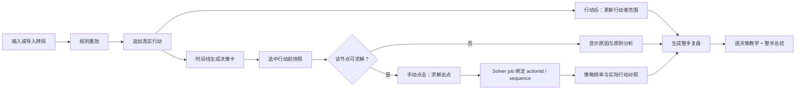

# Hand Review Workbench 产品与架构计划

状态：规划基线 1.0  
日期：2026-08-11  
适用范围：Riverline Hand Lab、Range Belief、Solver、Coach

## 1. 产品目标

下一阶段把现有的“单个最终节点分析工具”升级为面向已有基础玩家的“整手牌逐决策复盘工作台”。核心体验是：

1. 用户输入一个行动后，系统立即重放规则状态，并自动更新该行动者的范围信念；
2. 用户可以从时间线选择任意一个真实玩家行动，查看行动发生前的决策快照；
3. 用户按需点击“求解此点”，只为这个节点提交 Solver 作业；
4. Solver 完成后，系统把实际行动与有来源的策略频率并列展示；
5. 用户点击“生成整手复盘”，得到逐决策教学和整手总结，而不是只解释最后节点。

目标用户是已经理解德州扑克基本规则，希望系统补齐范围构建、行动逻辑和决策漏洞的玩家。

## 2. 成功标准

第一版完成时，一手包含多个街道和多个玩家行动的牌局应满足：

- 每个真实玩家行动都有稳定的 `actionId` 和对应的行动前快照；
- 输入行动后，范围区自动显示该行动者的 Prior / Current / Delta，或者明确显示 `no_policy`；
- 点击历史行动不会泄漏未来牌面或未来行动信息；
- 可求解节点能独立提交、轮询、取消和恢复 Solver job；
- Solver 有精确节点来源时才显示频率与背离标签；
- 整手教学逐点覆盖所有玩家行动，并对无证据节点诚实降级；
- 现有单节点 Analysis、Coach、Practice、Solver 流程和 E2E 契约保持兼容。

建议用以下产品指标验证价值：

- 完成一次整手复盘所需操作数和时间；
- 一手牌中成功生成范围更新的行动比例；
- 可求解节点中用户主动提交 Solver 的比例；
- 用户从整手总结进入某个决策详情的比例；
- 同类 mistake tag 在后续练习中的正确率变化。

## 3. 不在第一版范围内

- 自动为整手牌的所有节点提交 Solver；
- multiway Solver、翻前动态 Solver 或完整 Solver tree traversal；
- 在无精确策略来源时推断 GTO 频率；
- 根据单一混频概率直接宣判“好牌/坏牌”；
- 在当前 Solver 没有 action-specific EV 的情况下伪造 EV loss；
- population、player-specific、ML 或 Deep CFR 模型；
- 用 169 矩阵代替 combo 级 Range Belief 状态。

## 4. 核心交互流程



### 4.1 行动输入

用户仍通过现有 ActionBar 输入合法行动。追加行动后：

- 规则状态以 PokerKit 重放结果为准；
- 新行动成为时间线当前项；
- 范围区自动跟随该行动者，而不是固定跟随 Hero/Villain；
- 前端请求 Range Belief，并保留 `loading / available / unavailable / stale` 状态；
- Solver 与教学派生状态按节点保存，不能再用一个全局结果覆盖整手牌。

### 4.2 时间线选择语义

时间线需要区分两个游标：

- `eventSequence`：行动已经发生后的序列；用于显示范围如何因该行动变化；
- `decisionSequence = eventSequence - 1`：行动发生前的决策节点；用于规则分析、Solver 建议和实际行动对照。

`deal_flop / deal_turn / deal_river` 是状态转换，不生成可评分的玩家决策卡。牌局结束后仍可选择之前的决策卡。

### 4.3 自动范围更新

一次行动完成后，前端请求目标 seat 的 belief/trace：

- Prior：该 seat 在这条行动线开始前的 combo 级先验；
- Current：应用该 seat 已发生行动后的条件信念；
- Delta：Prior 与 Current 的 union 视图；
- Source：`preflop_policy / solver / fixture / manual / unknown`；
- unavailable：显示明确原因，不渲染伪 Current 矩阵。

前端只展示 169 聚合视图，所有推理与质量守恒继续在 combo 层完成。

### 4.4 手动节点求解

“求解此点”位于选中决策卡内。可用条件沿用当前 Solver gate：

- flop/turn/river；
- 决策点恰好两个 active players；
- 两个 active seat 的范围齐全；
- 决策快照和当前场景的 provenance 可验证。

每个 job 必须绑定：

- `actionId`；
- `decisionSequence`；
- `policySequence`；
- `actorSeat`；
- `scenarioFingerprint`；
- `spotFingerprint`。

场景变更只让不匹配的 job 变为 stale；历史卡片仍可保留已验证的结果引用。前端不得把一个节点的 Solver 结果应用到另一个节点。

### 4.5 Solver 背离表达

第一版只基于实际行动在 Solver 策略中的频率进行解释，不计算未经输出支持的 EV loss。

建议的展示状态：

| 状态 | 判定 | 对用户的表达 |
|---|---|---|
| `primary` | 实际行动是最高频行动 | 符合主策略 |
| `mixed` | 不是最高频，但频率达到产品阈值 | 可接受混频 |
| `rare` | 频率大于 0，但低于产品阈值 | 明显偏离常用策略 |
| `absent` | 精确节点中频率为 0 或动作不存在 | Solver 不采用该行动 |
| `unscored` | 无 Solver、provenance 不匹配、off-tree 或节点不受支持 | 无 Solver 结论 |

默认混频阈值建议为 5%，但必须作为产品解释阈值记录在 metadata 中，不能包装成扑克理论事实。下注尺寸 off-tree 时可以显示 nearest-size 映射，但第一版保持 `unscored`。

### 4.6 整手教学

新增整手复盘契约，不破坏现有单节点 `TeachingResponse`：

```text
HandReviewResponse
  handSummary
  priorityFindings[]
  decisionReviews[]
    actionId / eventSequence / decisionSequence
    street / actorSeat / actualAction
    stateBeforeAction
    analysisSummary
    rangeUpdate
    solverAssessment
    teaching
    evidenceBundleId
  uncertainty
```

每个 `decisionReview` 独立绑定行动前 EvidenceBundle。整手 summary 只能聚合已存在的逐点事实，不得跨节点引用未来牌面或把 `no_policy` 写成策略错误。

现有 `/v1/teaching` 和保存场景的 `/teach` 继续服务单节点解释；整手教学使用独立的版本化端点，建议为 `POST /v1/hand-reviews`。

## 5. 系统边界与数据流

```text
ScenarioSpec + selected action
  -> PokerKit replay at decisionSequence
  -> DecisionSnapshot
       -> analyze_scenario(snapshot) -> EvidenceBundle
       -> range trace at eventSequence -> RangeUpdate
       -> optional grounded jobId -> SolverAssessment
  -> DecisionReview
  -> ordered DecisionReview[]
  -> local/external teaching composer
  -> HandReviewResponse
```

关键约束：

- Snapshot 必须使用该节点已经可见的 board；
- decision actor 必须由 replay 验证，不信任前端推导；
- Range Belief 仍由 seat 驱动；
- Solver 频率只映射，不在 Coach 层重算；
- 每个数字必须属于该决策点的 EvidenceBundle 或 Solver evidence；
- action history sequence 保持连续，undo/redo 语义不变；
- 旧按钮名、aria-label、CSS hooks 和 E2E 文案保持兼容。

## 6. 前端信息架构

保留三栏 AppShell，但调整职责：

- 左栏：场景输入、手牌/牌面、模式与导入导出；
- 中栏：牌桌、合法行动、可选择的行动时间线；
- 右栏：所选 seat 的 Prior / Current / Delta 与该行动的关键变化；
- 底部工作区：Evidence、Coach、Practice、Solver 仍保留；选中行动后这些 tab 显示该节点内容；
- 新增 Hand Review 汇总视图：按时间顺序展示决策卡和 priority findings。

决策卡的最小信息：

- 街道、行动者、底池、有效筹码和实际行动；
- Range 更新状态和来源；
- Solver job 状态、提交/取消入口和 gate 原因；
- 实际行动频率与背离标签；
- 教学摘要与证据/不确定性入口。

## 7. 交付阶段

### 阶段 A：决策时间线与自动范围

- 建立行动前/行动后双游标；
- Range Belief 自动刷新并支持独立 seat；
- 解决请求竞态、stale 状态和 scenario mutation 失效；
- 用现有 API 完成可工作的前端闭环。

### 阶段 B：逐决策后端契约

- 构建 DecisionSnapshot 与 DecisionReview；
- 新增整手 review API；
- 对每个真实玩家行动生成独立 EvidenceBundle；
- 保持完成牌局、缺少手牌和 no-policy 的诚实降级。

### 阶段 C：按节点 Solver 与背离

- 前端把单个 `solveJob` 改为按 `actionId` 索引的 job registry；
- 选择历史节点时复用现有 submit/poll/cancel API；
- 后端验证 job provenance，并生成 SolverAssessment；
- off-tree 和 unsupported 节点保持 unscored。

### 阶段 D：整手教学与训练连接

- 本地与外部 Teacher 消费 ordered DecisionReview；
- 输出逐点解释、整手总结和 priority findings；
- 把高价值偏差映射到 mistake tag 和定向练习；
- 更新使用说明、E2E 和 PROJECT_STATE。

## 8. 发布门槛

- Backend：新增 snapshot/review/API 测试，完整 pytest 保持通过；
- Frontend：状态 hook、决策卡、Solver registry 和 Range auto-refresh 有 Vitest 覆盖；
- E2E：至少覆盖“输入行动 -> 范围更新 -> 选择节点 -> 手动求解 gate -> 逐点教学”；
- `tsc --noEmit`、Next build、现有 6 条 Playwright 流程保持通过；
- 完整 review 对同一 ScenarioSpec 可重复生成相同的结构化节点顺序；
- 任意 future board card 不得出现在较早 DecisionReview 的 evidence、range blockers 或 SolverSpot 中。

