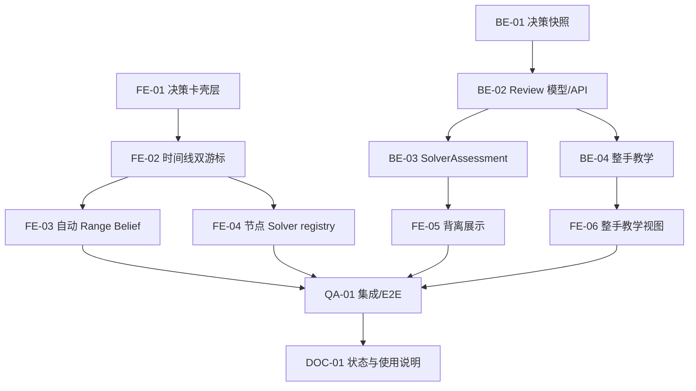

# Hand Review Workbench 任务执行表

状态：可执行拆分 1.0  
日期：2026-08-11  
上位设计：[Hand Review Workbench 产品与架构计划](hand-review-workbench-plan.md)

## 1. 执行原则

- 先锁定决策快照和响应契约，再让教学生成自然语言；
- 前端可以先用 fixture 建立决策卡，但不得自行计算规则、范围或 Solver 事实；
- 每个任务只拥有明确文件边界，避免并行 Agent 修改同一文件；
- 新接口版本化，现有单节点 API 和 E2E hooks 保持兼容；
- 每个阶段先通过窄测试，再运行对应完整测试门；
- 未经来源验证的 Solver result 只能显示为 unverified，不进入背离结论。

## 2. 依赖图

## 3. 任务清单

### BE-01：决策快照构建器

复杂度：高  
建议执行者：Terra  
依赖：无

目标：从完整 ScenarioSpec 为每个真实玩家行动重建行动前的合法、时间正确快照。

工作范围：

- 新增 review 包或等价模块；
- 跳过 deal 事件，但保留其对可见 board/street 的影响；
- 对每个行动生成 `eventSequence`、`decisionSequence`、`actorSeat`、`stateBeforeAction`；
- 使用 PokerKit replay 校验实际 actor 和合法动作；
- 完成牌局也能回看此前所有决策；
- 不修改现有 `ScenarioSpec` 和 replay 权威语义。

验收：

- HU 多街牌局得到顺序稳定的全部玩家决策；
- multiway/fold/all-in/finished-hand 有覆盖；
- turn/river 牌不会泄漏到 flop 决策；
- actor 不一致时返回结构化错误；
- 有独立窄测试命令且完整 backend 测试通过。

建议文件边界：

- `backend/poker_coach/review/`
- `backend/tests/test_decision_review.py`

### BE-02：DecisionReview 与 HandReview API

复杂度：高  
建议执行者：Terra  
依赖：BE-01

目标：输出逐行动的结构化分析，不先依赖 LLM 或 Solver。

工作范围：

- 定义版本化 `DecisionReview`、`HandReviewResponse`；
- 每个决策快照调用现有 analysis core；
- 每个节点保留独立 EvidenceBundle 与 warnings；
- 新增 `POST /v1/hand-reviews` 的 deterministic 基础响应；
- 缺少具体手牌、单人完成局和无 equity 均诚实降级。

验收：

- 两次玩家行动的牌局返回两条 review；
- 响应顺序与 action sequence 一致；
- 每个 evidence reference 只能引用本节点 bundle；
- 不改变 `/v1/analysis`、`/v1/teaching` 响应。

### BE-03：SolverAssessment

复杂度：高  
建议执行者：Terra  
依赖：BE-02

目标：把已持久化并通过 provenance 校验的 Solver job 与一个 DecisionReview 绑定。

工作范围：

- 输入 `actionId -> jobId` 映射；
- 重建 exact node spot 并复用现有 fingerprint 校验；
- 查找 actor/known combo 对应策略；
- 输出 actual action frequency、primary action、可用性和来源；
- 根据记录在 metadata 的产品阈值生成 `primary/mixed/rare/absent/unscored`；
- off-tree、无具体手牌、无 job 或不支持节点一律 unscored。

验收：

- 不匹配 job 被拒绝或标为 artifact mismatch；
- 频率来自 SolverNode，不重新求解；
- 不输出未经支持的 EV loss；
- 阈值边界和 mixed strategy 有测试。

### BE-04：整手教学编排

复杂度：高  
建议执行者：Terra  
依赖：BE-02；Solver 内容依赖 BE-03

目标：生成逐决策教学、整手总结与优先复盘点。

工作范围：

- 保留现有 TeachingResponse，新增 HandReview teaching contract；
- 本地 Teacher 先支持确定性模板；
- 外部 Teacher 接收有界、按节点分组的 facts；
- 对带数字文本继续强制 evidence references；
- no-policy/unscored 不能被描述为 Solver 错误；
- 输出可映射 mistake tag 的 priority findings。

验收：

- N 个玩家行动得到 N 个 decision teachings；
- 最早节点 prompt/facts 中没有未来牌；
- 外部模型输出漂移时能降级到本地 Teacher；
- 原有 teaching 测试不回退。

### FE-01：DecisionReviewList 展示壳层

复杂度：低  
建议执行者：Luna；无 Luna 时由独立默认 Agent 执行  
依赖：无，可使用 fixture

目标：建立纯展示的逐决策列表和卡片，不接管 page state。

工作范围：

- 新增前端 review 类型；
- 新增 `DecisionReviewList` / `DecisionReviewCard`；
- 展示街道、seat、实际行动、range 状态、solver 状态和教学摘要；
- 组件只消费 props，不发 API、不计算扑克事实；
- 添加 Vitest/Testing Library 覆盖空态、available、unscored、mixed。

验收：

- 所有状态有清楚的中文文案；
- `unscored` 不显示红色错误判断；
- 无裸 hex，颜色只走现有 token；
- 不改 `frontend/app/page.tsx`，保证与复杂任务并行。

建议文件边界：

- `frontend/types/handReview.ts`
- `frontend/features/review/DecisionReviewList.tsx`
- `frontend/features/review/DecisionReviewCard.tsx`
- 对应测试文件

### FE-02：时间线双游标与选中状态

复杂度：中  
依赖：FE-01

目标：时间线点击玩家行动时，同时暴露行动前决策和行动后更新语义。

工作范围：

- selected action 以 `actionId` 为真相源；
- 派生 `decisionSequence` 和 `eventSequence`；
- deal 事件不可作为 Solver 决策；
- undo/redo/load/reset 时稳定恢复或清除 selection；
- 保留现有 ActionTimeline E2E hooks。

### FE-03：行动后自动 Range Belief

复杂度：中高  
依赖：FE-02

目标：追加行动或选择行动后自动展示对应 actor 的范围变化。

工作范围：

- seat 选择从 Hero/Villain 扩展为连续 seatId；
- 调用现有 belief/trace API；
- 以 request token 或 AbortController 防止旧响应覆盖新节点；
- scenario mutation 使旧 belief stale；
- no-policy 保留 prior 和明确原因。

验收：

- 8-max exact RFI 可自动显示更新；
- 不支持节点显示 unavailable 而不是空白；
- 连续快速行动不会显示前一个节点结果；
- target seat own cards 与 future board blocker 语义不回退。

### FE-04：按 actionId 管理 Solver job

复杂度：高  
依赖：FE-02

目标：把全局单个 `solveJob` 改为节点 job registry，同时保留现有 Solver workspace。

工作范围：

- `Record<actionId, SolveJobState>` 或等价 reducer；
- 对选中行动构造行动前 scenario；
- 卡片内“求解此点”、取消和状态展示；
- 独立 polling token，场景变更时按 fingerprint 标 stale；
- 选中卡片时把该 job 投影给现有 SolverWorkspace。

验收：

- 两个不同节点的 job 不互相覆盖；
- 切换卡片不重启已完成 job；
- 仅显式点击时提交，不自动批量求解；
- 原有 solver disabled reasons 继续可见。

### FE-05：Solver 背离展示

复杂度：中  
依赖：BE-03、FE-01、FE-04

目标：在决策卡和 Solver tab 同时展示实际行动与策略频率的关系。

验收：

- 展示 actual frequency、primary action、source/confidence；
- primary/mixed/rare/absent/unscored 文案一致；
- off-tree 明确显示映射但不评分；
- 无 action-specific EV 时不出现 EV loss。

### FE-06：整手教学视图

复杂度：中  
依赖：BE-04、FE-01

目标：增加“生成整手复盘”，按顺序显示逐决策解释和整手 priority findings。

验收：

- 不替换现有单节点 TeachingPanel；
- 支持部分节点有 Solver、部分节点 principle-only；
- 完成牌局仍能生成；
- 可从 priority finding 跳转到对应 action card。

### QA-01：回归与端到端验证

复杂度：中  
依赖：所有集成任务

至少新增：

- Backend snapshot temporal-correctness 测试；
- HandReview API contract 测试；
- Frontend auto-belief race 测试；
- Solver registry reducer 测试；
- DecisionReviewList 状态测试；
- 一条完整 E2E：输入行动 -> 自动范围 -> 选择历史行动 -> 手动求解 gate -> 整手复盘。

完整门：pytest、compileall、pip check、vitest、tsc、next build、Playwright。

### DOC-01：文档收口

复杂度：低  
建议执行者：Luna；无 Luna 时由独立默认 Agent 执行  
依赖：各阶段实际完成状态

工作范围：

- README 链接本规划与任务表；
- 更新 `docs/使用说明.md`；
- 更新 PROJECT_STATE 的完成项、测试数字与已知边界；
- 如接口/语义最终发生变化，新增 ADR。

## 4. Agent 分工与首轮交接

### Terra 首轮：复杂后端基础

分配 BE-01，并在边界清晰且测试通过后继续 BE-02。首轮禁止修改 frontend、README、PROJECT_STATE 和现有用户改动的 `AGENT.MD`。

交付要求：

- 先给出要采用的测试 seam；
- 实现 DecisionSnapshot/DecisionReview 的最小完整切片；
- 运行窄测试与相关 backend 回归；
- 汇报改动文件、验证结果和 BE-02 是否已开始。

### Luna 首轮：简单前端展示

分配 FE-01；如果运行环境没有 Luna 模型，使用独立默认 Agent 作为明确记录的替代。首轮不得修改 `frontend/app/page.tsx`，避免与后续状态集成冲突。

交付要求：

- 用 fixture 定义最小类型；
- 实现纯展示组件和测试；
- 运行相关 Vitest 与 tsc；
- 汇报未来接入 BE-02 响应时需要调整的类型点。

## 5. 推荐提交边界

- Commit 1：规划文档；
- Commit 2：BE-01 决策快照与测试；
- Commit 3：BE-02 review API；
- Commit 4：FE-01 决策卡壳层；
- Commit 5：FE-02/FE-03 时间线与自动范围；
- Commit 6：FE-04/BE-03 节点 Solver 与背离；
- Commit 7：BE-04/FE-06 整手教学；
- Commit 8：E2E、使用说明与 PROJECT_STATE 收口。

提交前必须检查工作区，不能纳入已有的 `AGENT.MD` 修改或无关文件。

