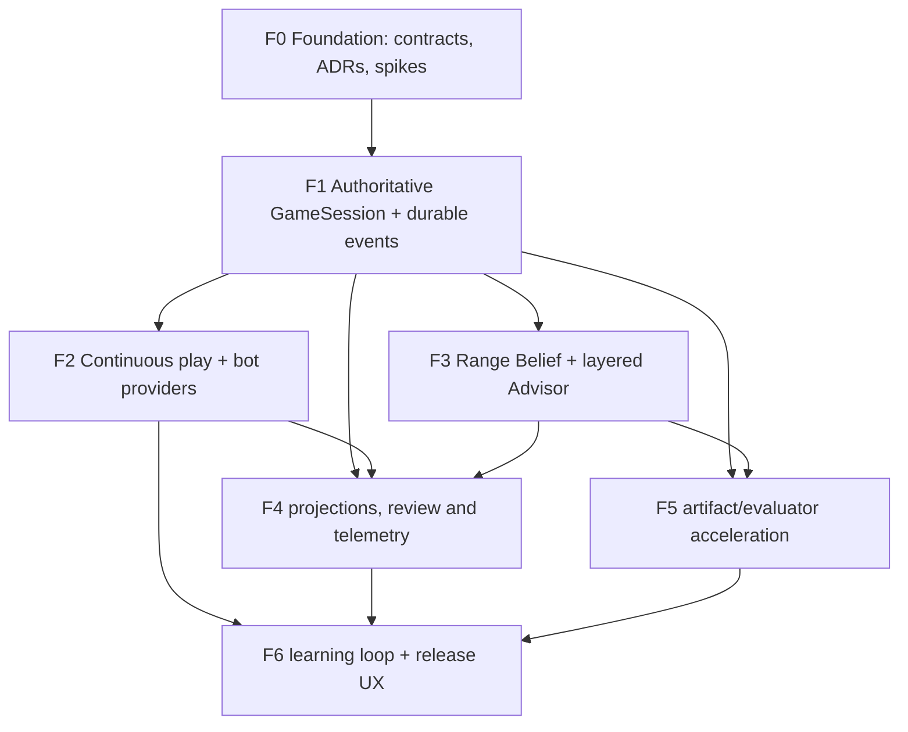

# Riverline simulator refactor master plan

Status: executable baseline after F0
Date: 2026-08-12
Product: observable Texas Hold'em cognitive simulator

## 1. Fixed scope and architecture invariants

The first releasable mode is 6-max NLHE cash, 100BB, no ante and no rake. Seat IDs, event envelopes and provider contracts remain valid for 2–8 players, but a broader topology is not a promise of strategy coverage.

The non-negotiable invariants are:

- PokerKit is the only online rules authority; PHH is an import/export format.
- The system is a modular monolith with explicit ports/adapters, not a collection of premature services.
- Ordered append-only events are the hand facts. Rule state, statistics, review, advisor and UI models are projections that can be rebuilt.
- `ObservationV1` is permission-safe. A bot never sees another player's cards or an internal Range Belief.
- Range Belief is a source-labelled, explainable approximation, never hidden-card truth.
- Agent, solver and optional evaluator failures must not stop the hand.
- Solver outputs are immutable, versioned artifacts. OpenSpiel/RLCard/PettingZoo inform research/adapter contracts and do not become online rules engines.
- Riverline is `AGPL-3.0-or-later`. Non-commercial use does not waive GPL/AGPL duties; every dependency and artifact retains provenance.
- Existing Hand Lab capabilities and E2E hooks remain available throughout migration. F0 does not authorize an unrelated frontend rewrite.

## 2. Stage boundaries and dependency graph

F0 freezes seams and removes the highest unknowns; it does not deliver a production continuous table. F1 owns authoritative session persistence. F2–F5 may then proceed in bounded parallel slices, but F6 cannot claim release readiness until continuous play, advisor/review evidence and learning projections meet their gates.

## 3. Parallel workstreams

| Workstream | Owns | May start | Must not own |
|---|---|---|---|
| Rules/session | GameSession, orchestrator, PokerKit adapter, event append/recovery, PHH boundary | F1 | Bot strategy, advisor explanations, UI state |
| Bot/agent | Provider adapters, runtime budgets, fallback, player profiles, self-play harness | F2 after F1 append/replay API | Rules or omniscient state |
| Belief/advisor | Seat priors, public-action likelihoods, formulas/equity, layered recommendations | F3 after F1 observation stream | Hidden-card truth or rule mutation |
| Projections/review | Stats, hand summary, review, telemetry/outbox consumers | F1 projection cursor available; expands in F4 | Authoritative hand state |
| Solver/evaluator research | Offline artifacts, differential/benchmark harnesses and optional acceleration adapters | F5 preparation can start after F0; integration after F1/F3 | Synchronous online rule path |
| Frontend/learning | Table shell, reveal modes, review navigation, learning profile and scheduling | UX shells can prototype against contracts; production wiring in F2/F6 | Poker rules, belief inference or solver recomputation |
| Governance | License/SBOM/provenance, security/privacy, performance and release evidence | Continuous | Product facts without executable evidence |

Parallel tasks must have disjoint file ownership or coordinate contract changes through a dedicated integration task. A contract version, event meaning or provenance rule cannot be changed independently by one workstream.

## 4. F0 — Simulator Foundation

### Delivered boundary

- Standard root AGPL v3 license text and third-party/provenance ledger.
- ADR-0005 through ADR-0008.
- Frozen `HandEventV1`, `ObservationV1`, `LegalActionV1`, and `BotDecisionV1` with deterministic serialization and explicit future-version rejection.
- 6-max event replay/projection fixture with order/duplicate detection.
- Async provider runtime with timeout/exception/illegal-action fallback provenance.
- Offline evaluator oracle/differential/benchmark harness; no candidate dependency added.

### F0 acceptance gate

- New public-seam tests pass alongside all existing backend tests.
- `compileall` and `pip check` pass.
- The fixed evaluator sample has zero current-oracle mismatches after the double-trips full-house correction.
- No frontend source changed; the inherited frontend/E2E baseline is explicitly identified rather than falsely rerun.
- Any unavailable candidate or unimplemented durability feature is recorded as future work, not “done.”

## 5. F1 — Authoritative GameSession and durable event flow

Entry: F0 contracts/ADRs accepted on the integration branch.

| Task | Deliverable | Depends on | Acceptance |
|---|---|---|---|
| F1-01 | `GameSession`/`HandId`/`SessionId` ownership and 6-max 100BB table configuration | F0 contracts | Starts/rotates hands without duplicating PokerKit rule logic; 2–8 topology validates |
| F1-02 | Durable `hand_events` append port and PostgreSQL/SQLite adapters | F1-01 | Unique `(hand_id, sequence)` and `event_id`; optimistic expected-sequence append; original JSON/provenance retained |
| F1-03 | PokerKit-backed `GameOrchestrator` reducer | F1-01/F1-02 | Every accepted action revalidates against PokerKit; chips conserved; fixed seed replay produces identical fingerprint |
| F1-04 | Projection cursor/checkpoint, snapshot cache and transactional outbox | F1-02 | Duplicate delivery is idempotent; failed projector resumes from cursor; snapshots can be discarded/rebuilt |
| F1-05 | PHH import/export adapter and golden fixtures | F1-03 | Completed hand round-trip preserves rules facts and source provenance; internal-only events remain outside PHH |
| F1-06 | Compatibility bridge to existing `ScenarioSpec`/Hand Lab | F1-03 | A historical hand opens in current review flows without renaming current API/E2E hooks |
| F1-07 | Recovery and long-run test harness | F1-02–F1-06 | Restart mid-hand, 1,000 seeded hands, side pots/all-ins, no illegal action, no chip drift |

Exit gate: authoritative continuous hand facts survive restart; event/projection recovery is proven; PHH and Hand Lab are adapters over the same facts. No bot/advisor feature may compensate for a failing rules/session gate.

## 6. F2 — Continuous table and bot providers

| Task | Deliverable | Depends on | Acceptance |
|---|---|---|---|
| F2-01 | In-process fixed and lightweight blueprint providers | F1 observation/action loop | At least three stable skill/profile configurations; deterministic seed; 100% decisions pass rule validation |
| F2-02 | External subprocess/RPC adapter | F1/F2-01 | Protocol version handshake, stdout/RPC bounds, timeout, crash, malformed JSON and oversized response tests |
| F2-03 | Runtime supervision | F2-02 | Per-provider budgets, cancellation, circuit breaker, resource caps and fallback metrics; hand always continues |
| F2-04 | Continuous `GameSession` API | F1/F2-01 | User can play consecutive hands; button/stacks rotate; reconnect returns authoritative projection |
| F2-05 | Bot evaluation harness | F2-01 | Seeded tournaments/self-play record payoff and failure rates without treating the harness as rules truth |
| F2-06 | Minimal table-centred frontend slice | F2-04 | Preserves current Hand Lab and E2E hooks; no frontend-derived legal action or hidden state |

Exit gate: seeded 6-max tables complete long runs with zero illegal committed actions; provider timeout/crash fallback success is 100% in fault-injection tests; table API reconnect/replay is deterministic.

## 7. F3 — Range Belief and layered Advisor

| Task | Deliverable | Depends on | Acceptance |
|---|---|---|---|
| F3-01 | 6-max seat priors and provenance schema | F1 events | Exact topology/stack/rake/ante/node coverage declared; unsupported nodes remain unavailable |
| F3-02 | Belief consumer over public events | F3-01 + existing combo engine | Own action likelihood updates only the actor; board blockers update all active seats; future/private information tests pass |
| F3-03 | Formula/L0 service | F1 state | Pot, call cost, legal sizes, pot odds and SPR under target latency with formula inputs/assumptions |
| F3-04 | L1 equity/evaluator port | F3-02 | Current evaluator remains default; optional backends cannot change rules and must pass differential gates |
| F3-05 | L2 policy/advisor composition | F3-01–F3-04 | Exact source label on every recommendation; no unsupported frequency or fabricated EV loss |
| F3-06 | Progressive advisor API/UI | F2-06/F3-03–F3-05 | L0/L1 appear first; deeper results update without blocking action; full/hint/exam permissions are explicit |

Exit gate: no hidden/future leakage; belief mass/provenance invariants pass; first advisor layer meets the measured latency budget; every unavailable result has a structured reason.

## 8. F4 — Projections, automatic review and telemetry

| Task | Deliverable | Depends on | Acceptance |
|---|---|---|---|
| F4-01 | Session stats projections (VPIP/PFR/3Bet and failure metrics) | F1-04 | Full rebuild equals incremental projection; duplicate consumption never double-counts |
| F4-02 | Decision telemetry contract | F2/F3 | Captures visible state fingerprint, actual action, advisor/belief versions, latency and reveal level without private leakage |
| F4-03 | Event-backed Hand Review adapter | F1-06/F3 | Existing review evidence boundaries remain; every review node is time-correct and source-grounded |
| F4-04 | Priority findings and honest uncertainty | F4-02/F4-03 | No single-hand result treated as decision quality; unsupported/no-policy nodes are unscored |
| F4-05 | Retention/privacy controls | F4-01–F4-04 | Delete/export paths, private-card handling and backup/restore tests documented |

Exit gate: projections can be destroyed/rebuilt; a completed hand automatically appears in review; telemetry and teaching cannot cite future/private facts.

## 9. F5 — Offline artifacts and optional acceleration

| Task | Deliverable | Depends on | Acceptance |
|---|---|---|---|
| F5-01 | Approved offline PH Evaluator environment spike | F0 harness | Exact version/hash/license; 0 mismatches; ≥2× representative p50; Python 3.13 supported platforms pass |
| F5-02 | Versioned `EquityBackend` adapter | F5-01 | Current backend remains fallback; candidate failure cannot affect rules or stop advisor |
| F5-03 | Solver job/artifact provenance revision | F1/F3 | Artifact fingerprint includes rules/ranges/tree/budget/engine/license; no synchronous hand dependency |
| F5-04 | Research producer isolation | F5-03 | AGPL solver is not a main dependency; source/build/modification duties and network-source obligations reviewed per distribution |
| F5-05 | Artifact cache and calibration | F3/F5-03 | Exact-node lookup only; mismatch/off-tree remains unscored; convergence/error metadata visible |

Exit gate: optional acceleration is demonstrably equivalent and removable; solver artifacts never masquerade as 6-max universal GTO or block play.

## 10. F6 — Learning loop, product UX and release

| Task | Deliverable | Depends on | Acceptance |
|---|---|---|---|
| F6-01 | LearningProfile/leak projections | F4 | Source decision IDs and model versions retained; deletion/rebuild supported |
| F6-02 | Concept/mistake mapping and exercise generation | F4/F6-01 | Exercises revalidate facts; loss/win alone never becomes a mistake label |
| F6-03 | `ReviewScheduler` port and optional py-fsrs adapter | F6-02 | Deterministic UTC boundary, versioned parameters and fallback scheduler |
| F6-04 | Full/hint/exam table experience | F2/F3/F4 | Reveal permissions enforced server-side; existing Hand Lab remains reachable |
| F6-05 | Reliability/performance/security/license release audit | All | Long-run completion, latency P50/P95, backup/restore, privacy, SBOM/NOTICE and AGPL network-source path pass |
| F6-06 | Product capability E2E | F6-01–F6-05 | Continuous play -> advisor -> automatic review -> exercise -> next-session learning is executable, not fixture-only |

Exit gate: one complete 6-max product loop meets reliability, honesty, learning, provenance and accessibility gates. Broader table formats remain explicitly experimental until their own gates pass.

## 11. Migration and rollback strategy

1. **Strangler entry, not replacement:** keep current Hand Lab endpoints and frontend hooks. Add simulator/session routes beside them and bridge completed event hands into `ScenarioSpec` for review.
2. **One write truth:** new simulator hands write only the append-only event store. Do not dual-write independent mutable hand snapshots. Projections may be dual-read during migration because they are disposable.
3. **Feature flag:** expose the table-centred flow behind a server-controlled capability flag until F2/F3/F4 gates pass. Disabling it stops new sessions but does not delete event history.
4. **Versioned persistence:** additive migrations create event/projection/outbox tables. Rollback disables readers/writers and restores the previous app version; it never drops event tables as part of an application rollback.
5. **Projection rollback:** keep projector version/cursor. A bad projector is replaced and rebuilt from events into a fresh projection version before traffic switches.
6. **Contract rollback:** stored V1 envelopes remain readable. New versions require explicit upcasters; no rollback rewrites historical event bytes.
7. **Provider rollback:** every optional bot/evaluator/solver adapter has a local fallback and can be removed from configuration without changing rules state.
8. **Frontend rollback:** new table components do not rename/delete existing E2E selectors or Hand Lab routes until a separate deprecation ADR and migration window.

## 12. Risks and controls

| Risk | Current evidence | Control / owner phase |
|---|---|---|
| Event model diverges from PokerKit | F0 fixture passes only one bounded hand | F1 golden/random long-run replay and adapter-only rule ownership |
| Projection double count/recovery loss | F0 is in-memory | F1 unique append, cursor, idempotency, failure/restart tests |
| Agent hidden-card leak | F0 observation schema and fixture pass | F2 adapter fuzzing/serialization audit; never pass omniscient models |
| Timeout still exhausts process resources | In-process timeout proven; no OS isolation | F2 subprocess/RPC limits and circuit breaker |
| Range Belief presented as truth | Existing honest-degradation constraints | F3 provenance/confidence/unavailable UI and temporal tests |
| Evaluator correctness/performance regression | F0 found and fixed one double-trips bug; candidate absent | Permanent oracle regression; F5 separate candidate gate |
| Solver licensing/provenance drift | Historical documents contained permissive/sidecar assumptions | ADR-0008, ledger, SBOM/source review; architecture isolation is not legal conclusion |
| UI rewrite breaks validated flows | F0 touches no frontend | F2/F6 hook-preservation E2E and additive migration |
| Scope expands to 8-max before 6-max closes | Contracts allow 2–8 | Phase gates measure only first-product 6-max until separately approved |
| WSL lacks required Python 3.13 | F0 used host 3.13 from WSL | Provision an approved offline WSL 3.13 toolchain before CI/release parity is claimed |

## 13. Standard verification gates

- Backend on Python 3.13: complete `pytest`, `compileall`, `pip check`, plus phase-specific long-run/fault/differential tests.
- Frontend when touched: complete Vitest, `tsc --noEmit`, production build and relevant Playwright/capability audits.
- Persistence phases: SQLite adapter tests plus real PostgreSQL migration/recovery evidence.
- Release phases: fully resolved dependency/SBOM/license/NOTICE report and AGPL source-access path.
- A phase report must distinguish tests actually run in that branch from an inherited baseline.
